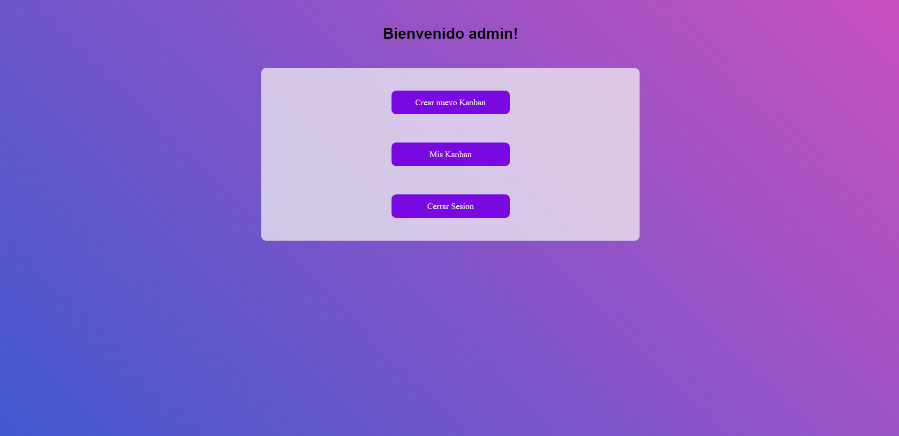
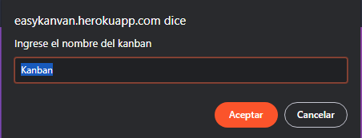
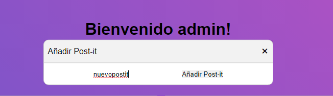
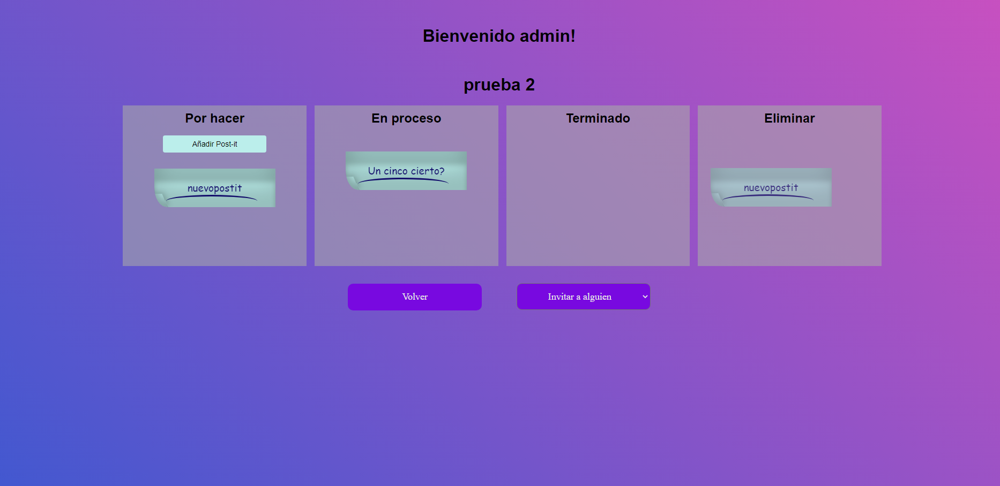
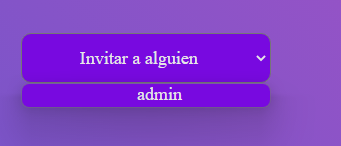
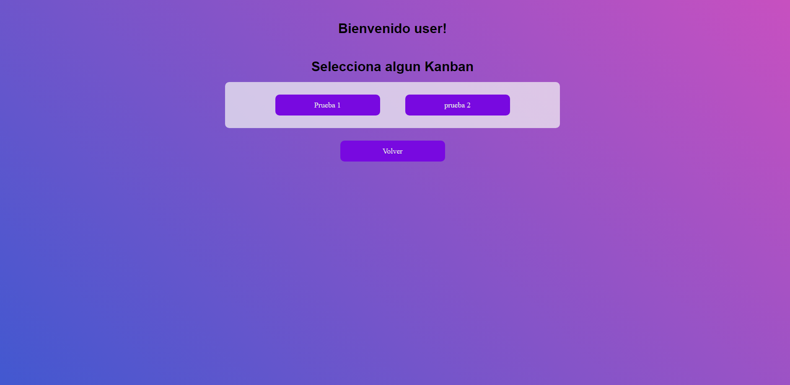
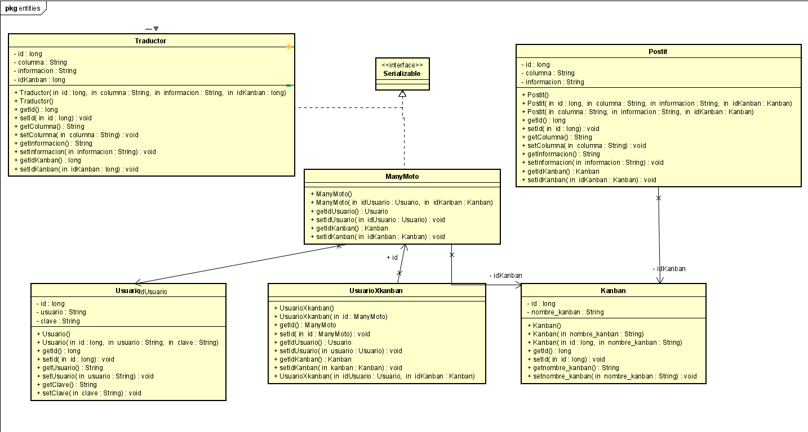
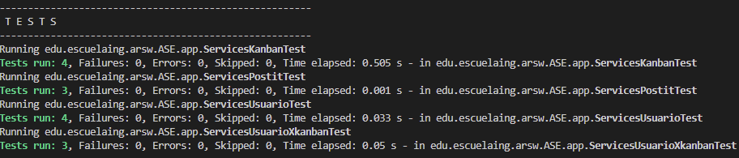

# EasyKanban

## Nicolas Palacios

## 13/06/2022

### Resumen

[](https://circleci.com/gh/nicolaspalacios-f/proyecto/tree/main)
[](https://www.codacy.com/gh/nicolaspalacios-f/proyecto/dashboard?utm_source=github.com&utm_medium=referral&utm_content=nicolaspalacios-f/proyecto&utm_campaign=Badge_Grade)  
link heroku:https://easykanvan.herokuapp.com/

El proyecto consiste en realizar un kanban colaborativo, esto herramienta permitiria registrar tareas/ideas y mirar el desarrollo de estas.

### Descripcion.

Muchas veces, solemos tomar notas para no olvidar cosas que debemos realizar, pero estas suelen quedarse en el olvido al no poder llevar un registo.
La idea de este proyecto sera crear una aplicacion que nos permita llevar un registro de nuestras ideas y del progreso que llevan estas, en caso de estar trabajando en equipo, se podran compartir ideas y llevar registro conjunto del progreso.

Podemos ver como se podria llevar un registro mas facil de las ideas y el progreso de estas, con eso ya no quedaran mas ideas olvidadas o tareas sin hacer.

### Historias de usuario.

COMO usuario QUIERO iniciar sesion PARA QUE pueda acceder a mi cuenta y ver mis kanban.

- Criterio de aceptacion: - Debe cumplir con criterios minimos de seguridad(validar contraseña, usuarios y permisos). - Debe existir la opcion de cerrar sesion.

COMO usuario QUIERO ver mis kanban PARA poder elegir a cual de proyectos quiero ver.

- Criterio de aceptacion: - Debe mostrar el nombre del kanban.

COMO usuario QUIERO crear kanbans PARA llevar un registro de mis ideas.

- Criterio de aceptacion: - Debe poder poner un nombre. - Debo poder ver el nombre. - Debe guardarse automaticamente. - Debe permitir agragar las ideas facilmente. - Debe existir la opcion de eliminar postits.

COMO dueño del kanban QUIERO invitar participantes PARA que puedan colaborar en mi kanban.

- Criterio de aceptacion: - Debe poderse invitar a alguien.

### Prerrequisitos

Para correr este se debe tener instalado:

- Maven
- Java

### Guía de uso

Para compilar el proyecto se debe usar:

```
mvn package
```

Para ejecutarlo, se debe hacer de la siguiente forma

```
$ mvn spring-boot:run
```

Al ingresar a la aplicación, vemos el login, se tienen 2 usuarios en base de datos, user y admin, cuya clave es el mismo nombre de cada una.


Una vez ingresado veremos 3 opciones, crear un kanban, mis kanban y cerrar sesión.


Si damos click a la opción crear kanban saldrá una opción para elegir el nombre.

Una vez elegido el nombre y dado en aceptar, saldrá el kanban.

Dentro del kanban veremos 4 columnas, en la primera hay un botón el cual nos permitirá añadir un nuevo postit.

Una vez dado en Añadir Post-it saldrá el postit creado. Si queremos mover un Post-it, se debe mantener click sobre el y desplazarlo donde queremos, para eliminar un Post-it tendremos que desplazarlo a la columna eliminar.

Para invitar a alguien a participar daremos al boton invitar a alguien, en el cual nos saldrán las personas disponibles para invitar.


  
    
      
En la segunda opción de nuestro menu, aparecerán los Kanban que hemos creado, si les damos click encima ingresaremos a ese Kanban



Finalmente la ultima opción es cerrar sesión, al darle click regresaremos al login.


### Estructura de Archivos

    .
    |____pom.xml
    |____src
    | |____main
    | | |____java
    | | | |____edu
    | | | | |____escuelaing
    | | | | | |____arsw
    | | | | | | |____app
    | | | | | | | |____TableroSocket.java
    | | | | | | | |____WebSiteController.java
    | | | | | | |____entities
    | | | | | | | |____Kanban.java
    | | | | | | | |____Postit.java
    | | | | | | | |____Traductor.java
    | | | | | | | |____Usuario.java
    | | | | | | | |____UsuarioXkanban.java
    | | | | | | |____repository
    | | | | | | | |____repositoryKanban.java
    | | | | | | | |____repositoryPostit.java
    | | | | | | | |____repositoryTraductor.java
    | | | | | | | |____repositoryUsuario.java
    | | | | | | | |____repositoryUsuarioXkanban.java
    | | | | | | |____rest
    | | | | | | | |____restKanban.java
    | | | | | | | |____restPostit.java
    | | | | | | | |____restTraductor.java
    | | | | | | | |____restUsuario.java
    | | | | | | | |____restUsuarioXkanban.java
    | | | | | | |____services
    | | | | | | | |____servicesKanban.java
    | | | | | | | |____servicesPostit.java
    | | | | | | | |____servicesTraductor.java
    | | | | | | | |____servicesUsuario.java
    | | | | | | | |____servicesUsuarioXkanban.java
    | |____resources
    | | |____static
    | | | |____js
    | | | | |____header.js
    | | | | |____kanvan.js
    | | | | |____login.js
    | | | | |____misKanvan.js
    | | | | |____movimiento.js
    | | | | |____postit.js
    | | | |____css
    | | | | |____css.css
    | | | | |____main.css
    | | | |____kanvan.html
    | | | |____home.html
    | | | |____index.html
    | | | |____tablero.html

### Diagramas.

#### Diagrama de entidades.



#### Diagrama de rest.


#### Diagrama de servicios.


#### Diagrama de Repository.


### Reporte de pruebas.

Se realizaron test de los 4 servicios de la aplicacion, estos representan lo mas importante de esta.

